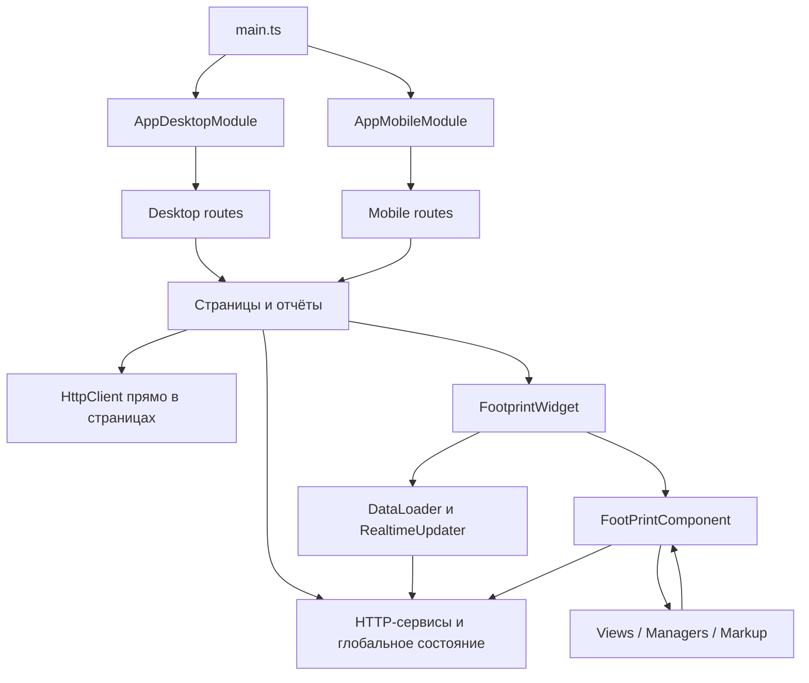

# Архитектура Angular-проекта и план рефакторинга

Дата: 22 сентября 2026 года. Основа: рабочая копия `Angular/mat`, HEAD `9d2e9cf`, включая существующие локальные файлы. Исходный код приложения в рамках анализа не изменялся.

**Главный вывод:** проекту нужен постепенный рефакторинг границ ответственности. Основные проблемы — общее изменяемое состояние отдельных графиков, отсутствие контроля актуальности некоторых асинхронных загрузок, тесная связь графического движка с Angular-компонентом и загрузка почти всего приложения при старте. Простое перемещение файлов по папкам эти проблемы не устранит.

## 1. Область и достоверность анализа

Проверены конфигурация workspace, bootstrap и оба набора маршрутов, структура `src/app`, библиотека `projects/stockchart-treemap`, основные сервисы, Footprint, опционные страницы, MCP-консоль, авторизация, обработка HTML и тестовая инфраструктура. Построен граф статических импортов TypeScript, сопоставлены дубли, выполнены сборка и существующие тесты.

Чтение крупных подсистем было выборочным, с проверкой конкретных цепочек зависимостей. Backend, браузерные сценарии, фактические права API и производительность на пользовательских устройствах не проверялись. Поэтому далее отдельно обозначены воспроизведённые проблемы, факты по исходникам и риски, требующие интеграционной проверки. Проверка уязвимостей npm-пакетов не выполнялась.

Ссылки на исходники относительны к этому документу; номера строк соответствуют рабочей копии на дату анализа.

## 2. Как приложение устроено сейчас

| Область | Текущее устройство | Архитектурное следствие |
|---|---|---|
| Запуск | `main.ts` выбирает `AppDesktopModule` или `AppMobileModule` по устройству | Две точки конфигурации одного продукта; обе статически импортированы |
| UI | Все найденные 128 компонентов объявлены `standalone: true` | Основа для локальных зависимостей и отложенной загрузки уже есть |
| Маршрутизация | Desktop: 91 объявление `path`, mobile: 37, включая вложенные маршруты и редиректы | Возможности и адреса двух оболочек расходятся |
| Организация кода | `components/pages`, `Reports`, `Controls`, `tables`, `service`, `services`, `models` | Один пользовательский сценарий распределён между техническими каталогами |
| Данные | Доменные HTTP-сервисы сосуществуют с HTTP-запросами прямо в страницах | DTO, нормализация, ошибки и состояние загрузки имеют разных владельцев |
| Footprint | Widget → загрузчик и realtime updater → renderer; renderer связан с views, managers, markup | Разделение начато, но компонент остаётся центральным объектом движка |
| Состояние | Поля компонентов, Subject/BehaviorSubject, глобальные сервисы, localStorage | Нет последовательного правила, какое состояние принадлежит приложению, странице или графику |
| Визуализации | Собственный canvas, treemap, Chart.js, ECharts, зависимости Highcharts | Нужны явные границы загрузки и адаптеры по сценариям |
| Treemap | Библиотека в `projects` и отдельная реализация в основном приложении | Два источника изменений одного компонента |
| Тесты | `npm test` запускает Jest; Angular targets настроены на Karma | Команды проверяют разные, неполные наборы файлов |

Упрощённая текущая схема:



### Что уже сделано удачно

- Компоненты уже standalone: массовая миграция компонентов на этот формат не нужна.
- У Footprint выделены загрузчик, realtime updater, layout, state и hint-сервисы. `FootprintWidgetComponent` задаёт локальные providers для загрузчика и updater и использует `takeUntilDestroyed`. Это хороший исходный уровень для дальнейшего разделения. [Исходник](../src/app/components/footprint/components/footprint-widget/footprint-widget.component.ts#L22).
- Реестр и API индикаторов описывают вычисления через контекст; ядро индикаторов и `ClusterData` уже имеют работающие тесты. [API индикаторов](../src/app/components/footprint/indicators/indicator-api.ts#L112).
- В realtime-подсистеме есть управление видимостью, последовательное выполнение операций, восстановление подписок и освобождение ресурсов. Рефакторинг должен сохранить эти свойства. [Realtime updater](../src/app/components/footprint/services/footprint-realtime-updater.service.ts#L14).
- Есть централизованные сервисы темы, публичный API treemap и примеры библиотеки. Их можно развивать как существующие границы.

## 3. Измерения и результаты проверок

Подсчёт выполнен по `src` и `projects`, без `node_modules`, сборок и vendored TinyMCE. Исходные TS-файлы исключают `*.spec.ts`, `*.test.ts`, `__tests__` и `*.d.ts`; включают примеры и потенциально неиспользуемый код. Строки учитывают комментарии и пустые строки.

| Метрика | Результат |
|---|---:|
| Исходные TS-файлы | 337 |
| Строки в них | 55 614 |
| Компоненты / файлы `*.service.ts` | 128 / 51 |
| Исходные TS-файлы длиннее 500 строк | 26 |
| Явные типы `any`, по AST | 512 |
| Файлы `*.spec.ts` / `*.test.ts` | 77 / 4 |
| Свойства маршрутов `loadComponent` / `loadChildren` | 0 / 0 |
| Файлы, импортирующие `MaterialModule` | 78 |
| Файлы, импортирующие `FootPrintComponent` | 38 |

Граф исходных импортов содержит взаимосвязанную группу из 60 файлов вокруг Footprint и отдельную пару `DialogService` ↔ `SupportDialogComponent`. Это граф исходников, включая зависимости, используемые как типы; он не доказывает наличие всех этих циклов в исполняемом JavaScript.

Выполненные команды:

```powershell
npm run ng -- build angular-material-login-template --configuration production --output-path .angular/architecture-review/production --stats-json
npm test -- --runInBand --coverage=false
node node_modules/typescript/bin/tsc -p tsconfig.spec.json --noEmit --pretty false
```

Окружение: Node.js `22.19.0`, npm `11.7.0`, Angular Core/CLI `20.3.13`, TypeScript `5.8.3`, установленный RxJS `7.8.2`.

| Проверка | Результат |
|---|---|
| Production build | Успешно |
| Начальные chunks | **6,36 МБ**, оценка передачи CLI **1,21 МБ** |
| `main` | 6,29 МБ |
| Отложенный chunk ECharts | 1,04 МБ; отложенная загрузка библиотеки есть, страниц — нет |
| Budget | Предупреждение: превышение 5,00 МБ на 1,36 МБ; сборку останавливает только порог 10 МБ |
| CSS | Оптимизатор пропустил два правила: `() ngx-mat-datepicker-content`, `() mat-icon` |
| Jest | 3 набора прошли, 1 упал; **23 теста прошли, 4 упали**, всего 27 |
| TypeScript для основного spec-набора | **10 ошибок компиляции** |

Оценка передачи CLI не является замером загрузки страницы. Coverage не измерялся. Angular/Karma-тесты в браузере не запускались; проверка `tsc` выявила препятствия ещё до такого запуска.

## 4. Что необходимо рефакторить

Приоритет **P1** — ближайшие изменения: корректность, проверяемость и существенная стоимость загрузки. **P2** — структурные изменения после стабилизации. **P3** — сопровождение и очистка. Приоритет не означает, что все пункты нужно объединять в один PR.

### R1. P1 — Изолировать состояние разметки каждого графика

**Факт.** `LevelMarksService` зарегистрирован в root и в модулях оболочек. Он хранит единственные `currentParams` и `markParamsData`; `load()` заменяет их, а `save()` и `togglePrice()` используют текущий тикер этого общего экземпляра. При этом доска избранного создаёт несколько полноценных графиков через один родительский injector. Локальные providers widget/renderer не переопределяют этот сервис.

Основания: [состояние и load](../src/app/service/FootPrint/LevelMarks/level-marks.service.ts#L115), [save](../src/app/service/FootPrint/LevelMarks/level-marks.service.ts#L206), [операции с ценой](../src/app/service/FootPrint/LevelMarks/level-marks.service.ts#L234), [создание графиков](../src/app/components/pages/favorites-board/favorites-board.component.ts#L260).

**Проверка.** Исходный класс выполнен отдельно с имитацией Angular-декоратора и localStorage в памяти, без сети: два потребителя общего экземпляра загружают SBER, затем GAZP; вызов `toggleDate()` первым потребителем записывает `levelsMark_GAZP`. Это воспроизводит проблему модели состояния; браузерный сценарий ещё требует проверки.

**Изменение.** Разделить `LevelMarksRepository` — HTTP/storage с явным ключом тикера — и `ChartMarksState`, принадлежащий конкретному widget. Минимальный переходный вариант: локальный provider сервиса на уровне widget, общий для его загрузчика и renderer. Для синхронизации двух графиков одного тикера использовать явный поток изменений по ключу.

**Готово, когда:** два графика разных тикеров независимо загружают, изменяют и сохраняют разметку; закрытие одного не сбрасывает второй; политика синхронизации одинаковых тикеров проверена отдельно.

### R2. P1 — Сделать результат загрузки зависимым от актуальных параметров

**Факт.** `FootprintWidgetComponent.ngOnChanges()` запускает `initializeDataFlow()` без ожидания предыдущего вызова. Загрузчик выполняет цепочки `await`, затем без проверки актуальности записывает `currentData` и публикует результат. `destroy()` сбрасывает поля, но не отменяет выполняющиеся запросы. После ожидания widget конфигурирует realtime по изменяемому `this.params`.

Основания: [ngOnChanges](../src/app/components/footprint/components/footprint-widget/footprint-widget.component.ts#L93), [initializeDataFlow](../src/app/components/footprint/components/footprint-widget/footprint-widget.component.ts#L212), [destroy](../src/app/components/footprint/services/footprint-data-loader.service.ts#L73), [применение результата](../src/app/components/footprint/services/footprint-data-loader.service.ts#L272).

**Риск по коду:** быстрые изменения A → B допускают применение позднего ответа A поверх B, несоответствие истории realtime-подписке или обновление после уничтожения widget. Такая же схема есть у опционного конструктора: выбор актива доступен во время загрузки, ответы серий и цепочки применяются без идентификатора запроса. [Загрузка серий](../src/app/components/pages/option-calc-portfolio/option-calc-portfolio.component.ts#L400).

**Изменение.** Один поток параметров страницы/графика с `switchMap` для заменяемых чтений либо проверяемый номер поколения запроса при сохранении Promise-подхода. История, настройки и realtime должны применять один снимок параметров. На уничтожении — отмена/инвалидация поколения. Сохранение пользовательских изменений требует отдельной политики очереди и не должно автоматически отменяться как чтение.

**Готово, когда:** тест с намеренно обратным порядком ответов оставляет данные B; запоздавший ответ после destroy игнорируется; realtime соответствует последней принятой истории.

### R3. P1 — Восстановить проверяемый набор тестов

**Факт.** Jest ищет только `__tests__/**/*.ts` и `*.test.ts`, поэтому 77 файлов `*.spec.ts` из workspace не запускаются через `npm test`. Его окружение — `node`; автоматического подключения Angular TestBed там нет. Одновременно `angular.json` содержит Karma targets. [Jest](../jest.config.ts#L1), [Angular test target](../angular.json#L93).

Четыре текущих падения — в `option.test.ts`: дата `30.12.19` передаётся в реализацию, ожидающую `YYYY-MM-DD`, после чего возникает `Неизвестный месяц: undefined`. При этом production-страницы импортируют другой класс — `OptionCodeService` из `OptionCodeParserService.service.ts`. Исправление только падающего файла не обеспечит проверку фактически используемого парсера. [Тест](../src/app/service/option.test.ts#L11), [разбор даты](../src/app/service/OptionCodeParser.service.ts#L282), [production-импорт](../src/app/components/pages/option-details/option-details.component.ts#L7).

Проверка spec-набора дополнительно выявила устаревшие имена экспортов в тестах spinner, payments dialog, optimization, barometers, mobile app и leaders, а также неправильный вызов конструктора директивы. В `app.component.spec.ts` standalone-компонент помещён в `declarations`, а ожидания всё ещё относятся к стартовому шаблону. [Тест AppComponent](../src/app/app.component.spec.ts#L5).

**Изменение.** Сначала явно разделить команды проверки чистого TS-ядра и Angular-компонентов; обеспечить запуск обеих в CI. Исправить существующий Karma/spec-контур либо отдельно мигрировать его на выбранный Angular-совместимый runner. Простого расширения `testMatch` недостаточно. Определить владельца и контракт парсера опционов, затем актуализировать его тесты.

**Готово, когда:** production build, тесты используемого доменного кода и значимые Angular-тесты входят в обязательную команду проверки; список запускаемых файлов известен; нет замены падающих сценариев пустыми `should create`.

### R4. P1 — Разделить загрузку страниц и конфигурацию оболочек

**Факт.** Оба root-модуля статически импортированы в `main.ts`; оба routing-файла статически импортируют страницы. В исходниках нет `loadComponent`/`loadChildren`. Кроме того, `main.ts` дважды создаёт сервис из `ngx-device-detector`, передавая второй раз экземпляр сервиса вместо platform ID, а затем читает приватное поле через `as any`. Это хрупкая зависимость от устройства стороннего класса. [Bootstrap](../src/main.ts#L1), [desktop routes](../src/app/app-routing.module.ts#L1), [mobile routes](../src/app/mobile/app.routes.ts#L1).

В mobile-маршрутах отсутствуют, в частности, desktop-адрес `auth/callback` и fallback `**`. Внешняя авторизация при этом используется общими компонентами. Это требует отдельного сценария проверки на мобильном устройстве; по исходникам нельзя утверждать успешность полного OAuth-перехода.

**Изменение.** Сначала вынести тяжёлые страницы и группы маршрутов в динамические импорты, сохранив текущие URL и редиректы. Общие маршруты авторизации вынести в один набор. Следующий шаг — общий bootstrap и providers с адаптивными оболочками; на переходный период допустима динамическая загрузка выбранного root-модуля. Для выбора устройства использовать публичный API, для расположения элементов — адаптивный layout.

Важная зависимость: root `DialogService` статически импортирует `SupportDialogComponent`, который импортирует редактор TinyMCE. Поэтому одной замены route declarations недостаточно: надо разорвать и цепочки от оболочки к тяжёлым диалогам. [DialogService](../src/app/service/DialogService.service.ts#L3), [SupportDialog](../src/app/components/Dialogs/support-dialog/support-dialog.component.ts#L11).

Статистика сборки подтверждает присутствие vendored TinyMCE, `xlsx`, KaTeX и Chart.js в начальном `main`. Редактор и экспорт стоит загружать по соответствующему действию. Разделение на chunks через маршрутизатор соответствует [механизму Angular lazy loading](https://angular.dev/guide/routing/loading-strategies).

**Готово, когда:** стартовая страница не загружает редактор, экспорт и неиспользуемые аналитические страницы; initial bundle меньше текущего порога 5 МБ, затем бюджет снижается по измерениям; deep links и вход проверены в обеих оболочках.

### R5. P1 — Выделить общий домен опционов и слой доступа к данным

**Факт.** `option-calc-portfolio.component.ts` — 924 строки, `option-calc-user-portfolio.component.ts` — 881, `volatility-smile.component.ts` — 1018. Внутри страниц находятся HTTP, DTO, приведение типов, состояние загрузки, параметры расчёта, геометрия графиков и tooltip.

У двух калькуляторов найдено как минимум 14 одинаковых методов длиннее восьми строк после исключения пробелов и комментариев. В их числе `calculate`, `buildMetricChart` (127 строк тела), `normalizeGraph`, `normalizeCalc`, `normalizeDate` и форматирование. [Первый buildMetricChart](../src/app/components/pages/option-calc-portfolio/option-calc-portfolio.component.ts#L512), [второй](../src/app/components/pages/option-calc-user-portfolio/option-calc-user-portfolio.component.ts#L451).

**Изменение.** Внутри `features/derivatives` выделить:

- API-клиент с DTO и явным преобразованием ответа;
- чистые функции построения серий, шкал и tooltip;
- общий компонент графиков PnL/греков;
- отдельные состояния сценариев конструктора и пользовательского портфеля.

Сохранить различающуюся логику ввода позиций в соответствующих страницах. Общность двух экранов следует выражать композицией, без большого базового компонента с флагами всех режимов.

**Готово, когда:** HTTP и нормализация не дублируются в компонентах; одинаковые входные данные дают одинаковые серии в обоих сценариях; загрузки имеют проверку актуальности из R2.

### R6. P1 — Сделать состояние сессии единым и проверенным сервером

**Факт.** `AuthGuard` синхронно вызывает `isAuthenticated()`, который считает пользователя вошедшим при наличии любой строки `userRoles` в localStorage. Отдельные методы `isSignedIn()` и `getLoggedUser()` уже обращаются к серверу, но guard не ждёт их результата. Административные страницы платежей, пользователей и тарифов объявлены без проверки роли в маршрутах. [Guard](../src/app/service/AuthGurad.service.ts#L12), [локальный признак](../src/app/service/auth.service.ts#L68), [маршруты](../src/app/app-routing.module.ts#L106).

**Следствие:** устаревшее локальное состояние может пропустить пользователя на страницу до ответа API; политика доступа распределена по UI. Доступность защищённых данных этим не доказана: серверные проверки не исследовались.

**Изменение.** Ввести одно состояние сессии `loading / anonymous / authenticated`, загрузку пользователя с сервера и общую обработку 401/403. Guards должны ожидать разрешения состояния и возвращать разрешение/редирект; административным сценариям нужна явная политика ролей. localStorage допустим как вспомогательный кэш интерфейса.

**Готово, когда:** refresh с истёкшей сессией, logout, прямой административный URL и внешний callback дают согласованное поведение. Авторизация API остаётся обязанностью backend.

### R7. P1 — Определить единую границу обработки HTML и Markdown

**Факт.** HTML из `topic.Text` помечается доверенным в двух компонентах; MCP-консоль делает то же с результатом Markdown-renderer, внутри которого вызывается `marked.parse`. Аналогичный обход есть в confirm-dialog. [Новости](../src/app/components/tables/topic-list/topic-list.component.ts#L54), [детали](../src/app/components/pages/service-news-details/service-news-details.component.ts#L73), [MCP](../src/app/components/pages/mcp-console/mcp-console.component.ts#L523), [Markdown](../src/app/service/markdown-renderer.service.ts#L210), [диалог](../src/app/components/Dialogs/confirm-dialog/confirm-dialog.component.ts#L20).

`bypassSecurityTrustHtml` отключает защитную обработку Angular и сам не очищает HTML. Обычная строка в `[innerHTML]` проходит встроенную обработку; поэтому сам `[innerHTML]="comment.Text"` не является доказательством уязвимости. Это различие описано в [документации Angular](https://angular.dev/best-practices/security).

**Изменение.** Для обычного текста использовать интерполяцию, для HTML — стандартную безопасную привязку. Для расширенного Markdown/KaTeX выделить один модуль рендеринга с явной политикой допустимой разметки и URL. Проверять итоговый HTML после всех преобразований; исключения из стандартной обработки должны быть узкими и обоснованными. Добавляемые сейчас через HTML стили перенести в CSS.

`MarkdownRendererService` в 1320 строк дополнительно объединяет Markdown, математику, разбор диаграмм и нормализацию их спецификаций. Разделить его на обработку блоков, валидаторы chart-spec и HTML-renderer. В MCP-странице оставить управление диалогом, а преобразование ответов API и trace вынести из компонента.

**Готово, когда:** все точки вывода используют общую политику; проверки охватывают HTML-атрибуты событий, опасные URL, некорректные chart-блоки и сохранность допустимых формул. Эксплуатация XSS в работающем приложении этим анализом не подтверждалась.

### R8. P2 — Отвязать ядро Footprint от `FootPrintComponent`

**Факт.** В компоненте 994 строки; 38 файлов импортируют его. `ViewsManager` хранит ссылку на весь компонент, а views через неё получают данные, settings, router/dialog-сервисы и меняют состояние. `canvasPart` принимает Angular-компонент как родительский объект. [Конструктор renderer](../src/app/components/footprint/components/footprint/footprint.component.ts#L150), [ViewsManager](../src/app/components/footprint/managers/views-manager.ts#L38), [canvasPart](../src/app/components/footprint/views/canvas-part.ts#L26).

**Изменение.** Ввести небольшие интерфейсы по назначению: данные для отрисовки, преобразования координат, запрос перерисовки, команды изменения разметки. Компонент реализует адаптацию Angular/DOM; движок получает контекст, не ссылку на компонент. Открытие диалога или переход по URL выражать событием/командой наружу.

Переносить по одному семейству views, начиная с простых шкал/фона. Использовать подход уже существующего `IndicatorContext`. Отдельно определить владельца изменяемых `ClusterData`, settings и renderer-состояния. Переход на `import type` полезен для ясности, но сам по себе не устраняет архитектурную связь.

**Готово, когда:** ядро и canvas-views не импортируют Angular-компоненты, router и диалоги; расчётные тесты запускаются без Angular; сохранены zoom, pan, indicators, markup и несколько графиков на странице.

### R9. P2 — Разделить UI-импорты и инфраструктурные providers

**Факт.** `MaterialModule`, импортируемый 78 файлами, экспортирует большой набор Material, формы, роутер, ECharts и Highcharts, а также регистрирует locale и `provideHttpClient(withInterceptorsFromDi())`. Root-модули одновременно импортируют `HttpClientModule`. Есть второй набор Material-экспортов в `AngularMaterialModule`. [MaterialModule](../src/app/material.module.ts#L89), [desktop providers](../src/app/app.desktop.module.ts#L19), [второй модуль](../src/app/angular-material.module.ts#L76).

**Следствие:** импорт визуального модуля неявно конфигурирует инфраструктуру. После введения lazy boundaries становится особенно трудно контролировать, какой injector обслуживает HTTP и где работают interceptors. Это риск конфигурации, а не измеренный факт поломки каждого текущего запроса.

**Изменение.** HTTP, locale и общие сервисы настроить явно в корне приложения; конкретные визуальные зависимости подключать у потребителей. Для временно сохраняемых двух bootstrap-конфигураций использовать одну общую фабрику providers. Движки графиков подключать внутри соответствующих features. Размещение HTTP-конфигурации на уровне приложения поддерживается [официальным API Angular](https://angular.dev/guide/http/setup).

Отдельно унифицировать API base URL: сейчас `environment.apiUrl` сочетается с жёсткими `/api/...` в компонентах и `CommonService`. Same-origin может быть корректным решением, но правило должно быть единым. `DateConversionInterceptor` не зарегистрирован в активной конфигурации; преобразования дат лучше сделать явными на границе конкретного DTO, различая календарную дату и момент времени.

**Готово, когда:** импорт shared UI не создаёт HTTP-конфигурацию; запросы lazy-страниц проходят ожидаемые interceptors; DTO и доменные даты имеют определённые форматы.

### R10. P2 — Объединить treemap в одну реализацию

**Факт.** `src/app/components/Controls/tree-map` и `projects/stockchart-treemap/src/lib/tree-map` содержат копии. HTML, layout и utils совпадают после нормализации переводов строк; TS-компоненты, CSS и модели различаются. В приложении уже есть интеграция с цветовыми утилитами темы, которой нет в библиотечном варианте. [App-компонент](../src/app/components/Controls/tree-map/tree-map.component.ts#L20), [библиотека](../projects/stockchart-treemap/src/lib/tree-map/tree-map.component.ts#L20).

Приложение импортирует локальную копию, примеры — `stockchart-treemap`. Дополнительно package.json объявляет npm-зависимость `^1.0.0`, установлен пакет `1.0.0`, workspace-библиотека имеет версию `1.0.2`, а tsconfig alias сначала указывает на её исходники. Это три разных способа получить компонент.

**Изменение.** Собрать функциональные различия и сделать библиотеку единственным владельцем renderer/layout. Настройки темы передавать через options/CSS tokens, без обратного импорта `src/app` из библиотеки. В приложении оставить адаптер рыночных данных. Однозначно определить: потребляется workspace source или собранный пакет.

**Готово, когда:** основной продукт и оба примера используют один публичный API; поведение светлой/тёмной темы, layout и events проверено; библиотека собирается самостоятельно.

### R11. P2 — Ограничить глобальную шину событий и время жизни подписок

**Факт.** `MatEventEmitterService` — root-сервис с публичными нетипизированными Subject/ReplaySubject. Мобильная страница Footprint подписывается на `onDataChange`, `onSideNavOpen` и `onSideNavClosed` без механизма очистки. Её `ngOnDestroy()` завершает отдельный `unsubscribe$`, который подключён лишь к части подписок. [Шина](../src/app/service/mat-event-emitter.service.ts#L8), [подписки страницы](../src/app/mobile/first/first.component.ts#L178).

**Следствие:** root-поток сохраняет обработчики уничтоженной страницы; повторный вход может добавлять новые реакции. Наличие `.subscribe()` само по себе не является проблемой: конечные HTTP-потоки и долгоживущие события нужно различать.

**Изменение.** Связи родителя и потомка выражать inputs/outputs; состояние shell держать в одном ограниченном по области сервисе. Subjects сделать закрытыми, события — типизированными. Подписки компонентов на долгоживущие потоки завершать через `takeUntilDestroyed` или единый существующий teardown-механизм.

**Готово, когда:** после повторных входов/выходов страницы одно событие вызывает ровно одну реакцию; уничтоженная страница не удерживается общей шиной.

### R12. P2/P3 — Усилить контракты, структуру features и воспроизводимость

**Типизация, P2.** В `tsconfig.json` выключены `strict` и `strictTemplates`; найдено 512 явных `any`. Начать с DTO, параметров графика, payload событий и границ renderer. Внешний неизвестный ответ принимать как `unknown` и проверять/преобразовывать. Для вынесенного чистого ядра или библиотеки включить отдельную строгую проверку; основное приложение переводить по мере исправления ошибок, без массовой замены на assertions. [Конфигурация](../tsconfig.json#L8).

**Структура, P2.** Размещать страницы, сценарии, DTO и адаптеры рядом внутри `features`. Разделить `core` с инфраструктурой приложения и `shared` с повторно используемыми UI/утилитами. Добавить проверяемое правило импортов: domain не импортирует UI/Angular, shared не импортирует features. Организация по предметным областям согласуется с [Angular style guide](https://angular.dev/style-guide); конкретные границы ниже предложены по устройству этого проекта.

**Воспроизводимость, P2.** `package-lock.json` существует, но на момент анализа имеет статус `??` и не отслеживается Git. Перед переходом CI на `npm ci` нужно проверить и включить согласованный lockfile в репозиторий. В package scripts нет команд lint/e2e; стоит добавить проверку архитектурных импортов и критических пользовательских сценариев. Самостоятельная миграция build system не является первым шагом: production-сборка сейчас работает.

**Статика и стили, P3.** `src/assets` содержит около 70,6 МБ; среди копируемых файлов — `shares.zip`, `tinymce.zip`, `images/logos.7z`, `usa.html`. TinyMCE дополнительно копируется в `/tinymce/`, при этом редактор использует `/assets/tinymce`. Это размер артефакта развёртывания, не объём автоматической загрузки при открытии страницы. Сначала проверить потребителей адресов, затем исключить служебные архивы и лишнее копирование. [Assets](../angular.json#L24), [base_url редактора](../src/app/components/Controls/timy-mce/app-editor.component.ts#L78).

В сборку подключён `src/styles.css`; рядом есть альтернативный `styles.scss`. В активном CSS блок `::ng-deep` порождает два предупреждения оптимизатора. Нужно оставить понятный источник глобальной темы и заменить проблемные правила на явно ограниченные селекторы. [Проблемный блок](../src/styles.css#L322).

**Остатки старого кода, P3.** Кандидаты на проверку достижимости: закомментированный `app.module.ts`, неиспользуемая bootstrap-конфигурация `mobile/app.config.ts`, шаблонные маршруты `devfestfl`, `portfolio copy`, альтернативный `FootPrint/MarkLevels`, старый парсер опционов и отдельный каталог `src/shares`. Удалять после проверки импортов, динамических обращений и build-скриптов. README всё ещё описывает login-template и должен объяснять фактический запуск проекта.

## 5. Предлагаемая целевая структура

Это направление постепенного переноса. Создавать пустые каталоги или перемещать всё приложение одним изменением не требуется.

```text
src/app/
  app.config.ts                  # общие providers
  app.routes.ts                  # композиция lazy routes, старые URL сохранены
  shell/
    desktop/                     # навигация и расположение элементов
    mobile/
  core/
    auth/                        # сессия, guards, реакция на 401/403
    http/                        # конфигурация и общие interceptors
    realtime/                    # транспорт соединения
    theme/
  shared/
    ui/                          # универсальные controls и dialogs
    formatting/
  features/
    footprint/
      domain/                    # ClusterData, geometry, indicators, contracts
      application/               # жизненный цикл и состояние одного графика
      data-access/               # HTTP, realtime-адаптеры, storage
      ui/                        # widget, canvas adapter, settings
    derivatives/
      domain/                    # модели опционов и преобразования расчётов
      application/               # состояния двух портфельных сценариев
      data-access/               # API опционов
      ui/                        # страницы и общие графики
    market/                      # карта, лидеры, отчёты
    fundamentals/                # отчётность, дивиденды, держатели
    bonds/
    content/                     # новости и редактор
    mcp-console/                 # чат, блоки, renderer-адаптеры
    billing/                     # тарифы и пользовательские платежи
    admin/                       # отдельная политика доступа
projects/stockchart-treemap/      # единственная реализация treemap
```

Правила владения и зависимостей:

| Что | Владелец / срок жизни |
|---|---|
| Сессия пользователя, тема, транспорт SignalR | Приложение |
| Фильтры страницы, состояние запроса | Экземпляр feature/page |
| История, viewport, selection, indicators, marks | Конкретный экземпляр графика |
| Кэш общих справочников | API/repository с явным ключом и правилами сброса |
| Сохраняемые пользовательские настройки | Repository с версией формата и явным идентификатором |

UI вызывает сценарии feature; сценарии используют domain и адаптеры данных. Domain не зависит от Angular-компонентов, HTTP, DOM и диалогов. Canvas-renderer может зависеть от браузерного Canvas API, но получает данные через небольшие контракты. Связь разных features проходит через публичные интерфейсы, а не глубокие импорты внутренних компонентов.

## 6. Порядок выполнения

| Этап | Небольшие изменения | Условие завершения |
|---|---|---|
| 1. Основа проверки | R3: явные test scripts, исправление текущих падений и spec-компиляции; согласованный lockfile | Воспроизводимая обязательная проверка; известен её охват |
| 2. Корректность графиков | R1: локальное состояние меток; R2: актуальность загрузок; R11: очистка событий | Два графика, быстрые переключения и повторные входы проверены |
| 3. Сессия и контент | R6 и R7 отдельными изменениями | Проверены истёкшая сессия, роли, callback и политика HTML |
| 4. Загрузка приложения | R9: providers; затем R4: lazy routes, диалоги и редактор | Initial ниже 5 МБ; сохранены URL и работа обеих оболочек |
| 5. Устранение повторений | R5: опционные API/графики; R10: одна библиотека treemap | Общая логика имеет одного владельца и поведенческие проверки |
| 6. Границы ядра | R8: интерфейсы и последовательный перенос views; R12: features и строгие контракты | Ядро не импортирует UI; новые обратные зависимости запрещены |
| 7. Сопровождение | Удаление подтверждённо неиспользуемого кода, очистка assets/CSS, актуальный README | Нет лишних копий и неясных точек входа; инструкции запуска соответствуют коду |

Этапы 2 и 3 можно вести независимо после подготовки своих регрессионных проверок. Стоимость этапа с Footprint существенно выше устранения дублей или настройки routes: его разумно разбить по семействам views. Календарную оценку без сведений о команде и обязательных сценариях давать преждевременно.

Проверки, которые дают наибольшую защиту при этом рефакторинге:

1. Два графика разных тикеров: разметка, настройки, уничтожение одного экземпляра.
2. Быстрое A → B с ответами B → A: история и realtime остаются на B.
3. Скрытие/возврат графика, reconnect и отсутствие повторных realtime-подписок.
4. Опционные портфели: согласованные DTO, даты, нормализация и одинаковые серии общих графиков.
5. Прямые URL, refresh, внешняя авторизация и административные страницы в обеих оболочках.
6. Допустимый и опасный HTML/Markdown; сохранение формул и корректных chart-блоков.
7. Treemap: оба layout-режима, события, изменения размеров и обе темы.

Архитектурный рефакторинг следует оценивать по этим свойствам, направлению импортов, числу владельцев состояния и размеру загрузки. Сокращение количества строк компонента полезно только тогда, когда выделенная часть получает самостоятельную ответственность и проверяемый контракт.
