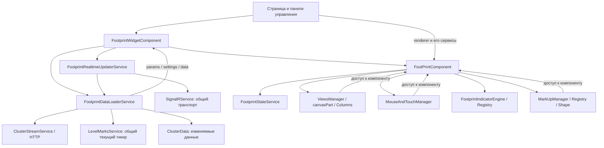

# Архитектурный разбор FootPrint

Дата: 28 сентября 2026 года. Анализ текущих файлов рабочего дерева.

**Статус:** этапы 1 «Корректность», 2 «Сессия», 3 «Ресурсы и кадр», 4 «Границы» и 5 «Измерения и чистка» реализованы. Исходный разбор ниже сохранён как обоснование; изменения и результаты проверок перечислены в конце документа.

## Вывод

**Рефакторинг стоит делать, поэтапно. Сначала исправить согласованность загрузки, realtime и индикаторов, затем отделить графическое ядро от Angular-компонента.** Оснований переписывать весь FootPrint, менять Canvas на другую библиотеку или вводить глобальный state management сейчас нет.

Текущее разбиение уже полезно: загрузчик, realtime updater, layout, индикаторы и инструменты разметки выделены отдельно. Однако границы ответственности проведены не до конца: компонент остаётся общей точкой доступа почти ко всему состоянию, а несколько частей независимо управляют одним жизненным циклом графика. Это создаёт конкретные риски неверных данных, а не только неудобство сопровождения.

Наибольшую пользу дадут четыре изменения:

1. Единая сессия графика: параметры, история и realtime принадлежат одной версии запроса.
2. Явное описание изменений данных для обновления кэшей и расчёта индикаторов.
3. Изоляция меток между графиками и учёт потребителей одинаковых SignalR-подписок.
4. Контракты render context и chart commands вместо передачи целого `FootPrintComponent`.

## Область и ограничения анализа

Изучены `src/app/components/footprint`, `src/app/service/FootPrint`, связанные модели, настройки тестов и места использования widget на основной и мобильной страницах. В двух основных каталогах: 129 TypeScript-файлов, из них 117 вне файлов тестов, около 24 164 строк. Это размер файлов с комментариями и пустыми строками, а не метрика сложности сама по себе.

Крупные узлы: `footprint.component.ts` — 993 строки, `cluster-data.ts` — 925, `signalr.service.ts` — 718, `mouse-touch-manager.ts` — 558, `views-manager.ts` — 552, `indicator-engine.ts` — 518, `footprint-layout.service.ts` — 502.

Анализ выполнен по исходникам и локальным проверкам. Полная Angular-сборка, браузерное профилирование, работа с реальным сервером и проверка серверного SignalR-протокола не выполнялись. Ниже отдельно обозначены воспроизведённые дефекты, выводы из кода и гипотезы производительности. Существующие пользовательские изменения учитывались как часть текущего состояния; исходники не менялись.

## Как устроено сейчас



Widget организует потоки и предоставляет методы загрузки. Loader получает presets/settings/метки/историю, держит `currentData` и применяет realtime к этому объекту. Realtime updater управляет подписками, видимостью и восстановлением после merge failures. Компонент хранит состояние через `FootprintStateService`, создаёт менеджеры и движок индикаторов, управляет геометрией, темой и перерисовками. `ViewsManager` строит части canvas и вызывает их отрисовку.

### Что стоит сохранить

- **Сервисы загрузки и realtime на уровне widget.** Они уже создаются отдельно для каждого widget через `providers`, что правильно для независимых графиков.
- **Registry + Definition + Instance у индикаторов.** Новые индикаторы добавляются без расширения большого условного оператора в компоненте. API расчётов отделён от canvas, используется `Float64Array`.
- **Registry разметки.** Полезная точка расширения, хотя реализации фигур пока зависят от компонента.
- **`ClusterColumnContext`.** В `Columns/cluster-column-base.ts:11` уже есть пример ограниченного контракта для отрисовки. Его можно развить вместо создания нового механизма с нуля.
- **Layout DTO и Matrix.** Расчёт расположения и преобразования координат уже имеет отдельные модели.
- **Объединение realtime-перерисовок через RAF.** Комментарий в loader об отказе от повторной публикации того же объекта на каждый tick соответствует выбранной изменяемой модели. Это полезная оптимизация; ей нужен явный протокол изменений.
- **Scoped realtime streams и восстановление соединения.** В SignalR есть фильтрация событий по ключам подписок и повторная подписка после reconnect. Общий транспорт имеет смысл сохранить.

## Приоритетные проблемы

P1 — исправить до существенного расширения функциональности; P2 — плановый рефакторинг; P3 — последующая чистка. Приоритет отражает последствия, а не объём файла.

| Приоритет | Проблема | Статус доказательства |
|---|---|---|
| P1 | Кэш свечей индикаторов устаревает при обновлении существующего бара | Воспроизведено локально |
| P1 | Конкурирующие загрузки и переход между историей/realtime не образуют одну сессию | Следует из кода; нужен интеграционный тест |
| P1 | `LevelMarksService` делит текущий тикер и метки между графиками | Следует из DI и состояния сервиса |
| P1 | Одинаковые cluster-подписки не учитывают число потребителей | Следует из клиентского кода; влияние на доставку требует проверки с сервером |
| P1 | Пустая история вызывает исключение в `ClusterData` | Воспроизведено локально |
| P2 | Завершение работы не охватывает все ресурсы и поздние async-ответы | Следует из кода |
| P2 | Canvas и UI зависят от целого Angular-компонента | Подтверждено связями исходников |
| P2 | Несогласованная публикация состояния, побочные эффекты и повторные render paths | Подтверждено исходниками; стоимость не измерена |
| P2 | Состояние загрузки/ошибки/пустого результата и тесты оркестрации недостаточны | Подтверждено исходниками и конфигурацией тестов |

### 1. Протокол обновления данных и кэш индикаторов

Места: `indicators/indicator-engine.ts:117, 416`, `models/cluster-data.ts:487`, `services/footprint-data-loader.service.ts:83`, `indicators/builtins/technicalindicators-adapter.ts:46`.

`ClusterData` меняется внутри того же экземпляра. `ensureCandlesCache()` перестраивает свечи только при смене экземпляра или количества баров. Если realtime обновляет существующую свечу, обе проверки остаются прежними и `ctx.candles` содержит старые OHLCV. При этом `ctx.source()` читает непосредственно `clusterData` и видит новое значение. Разные индикаторы получают разные представления одних данных; адаптеры, использующие свечи и их signature, могут не пересчитываться.

Локальная проверка: после первого `prepare()` изменён `clusterData[0].c` со 100 на 110, затем вызван повторный `prepare()`. Результат:

```json
{"sourceClose":110,"cachedCandleClose":100}
```

Воспроизведение использовало настоящий `ClusterData` и `FootprintIndicatorEngine`, пустой registry и чтение контекста через JavaScript; HTTP и браузер не требовались.

Кроме того, merge может заменить несколько баров хвоста, а engine выбирает диапазон по количеству баров и `warmupPeriod`. При изменении предпоследних баров этого недостаточно для индикаторов с нулевым warmup или длинной рекурсивной зависимостью. Даже увеличение длины может сопровождаться изменением уже существовавшего хвоста.

**Изменение:** добавить версию данных и описание изменения: `revision`, `changedFrom`, вид изменения `reset / append / replaceTail / ladder`. Обновлять свечной кэш начиная с первого изменённого бара; пересчитывать зависимые значения до конца с учётом контракта конкретного индикатора. Ladder не должен инвалидировать OHLCV. Полный пересчёт можно использовать как временное исправление, затем оптимизировать диапазон.

Критерии: изменение последнего бара, замена нескольких баров без изменения длины и append с исправлением хвоста дают тот же результат, что полный расчёт на актуальной истории.

### 2. Загрузка и realtime должны принадлежать одной версии графика

Места: `components/footprint-widget/footprint-widget.component.ts:93, 110, 212`, `services/footprint-data-loader.service.ts:56, 115, 251`, `services/footprint-realtime-updater.service.ts:57, 438`.

`ngOnChanges()` запускает `initializeDataFlow()` без ожидания предыдущего вызова. `reload()` и recovery reload тоже могут запустить загрузку. В loader нет отмены или проверки актуальности запроса; `options` и `presetIndex` общие для выполняющихся операций. Параметры нормализуются через `Object.assign()` непосредственно во входном объекте.

Сценарий: пользователь выбрал A, затем B. Запрос B завершился первым, A — последним. Старый ответ может заменить `currentData`, хотя параметры уже B. `initializeDataFlow()` после ожидания использует `this.params`, которое также могло измениться.

Realtimе подписка перенастраивается **после** завершения загрузки. Пока грузится B, подписка A может продолжать обновлять текущие данные. Есть и промежуток после публикации истории B до завершения teardown подписки A. Loader применяет payload к `currentData` без проверки принадлежности этой истории подписке. Очередь в updater сериализует операции самого updater, но не внешние загрузки widget.

**Изменение:** ввести объект сессии графика с неизменяемой копией нормализованных параметров, `sessionId` и ключом данных. На переходе остановить применение событий старой сессии; историю и настройки публиковать только для актуальной версии; затем подключать realtime этой версии. Для устранения пропуска событий между snapshot и подпиской выбрать явную стратегию: subscribe + buffer + snapshot + replay либо получение актуального хвоста после subscribe. Точный порядок согласовать с серверным протоколом.

Можно реализовать через отменяемую RxJS-цепочку или generation token. При выборе `switchMap` важно сохранить отменяемость HTTP: уже созданный Promise сам по себе не отменяет запрос. Проверка sessionId нужна также после `await`, в recovery и при destroy.

Критерии: A → B с обратным порядком ответов оставляет только B; поздние события A не меняют B; recovery старой сессии не возвращает её после нового выбора.

### 3. Изолировать состояние меток по графику

Места: `service/FootPrint/LevelMarks/level-marks.service.ts:115, 119, 151, 265`, providers widget и renderer.

`LevelMarksService` зарегистрирован в root и хранит единственные `currentParams` и `markParamsData`. Widget и renderer не переопределяют его provider. При загрузке второго графика меняются метки, которые читает первый. Изменение уровня в первом графике может обратиться к серверу с тикером последнего загруженного графика. Mini-mode через `skipServer` также обнуляет общие price levels.

`loadToken` и `loadQueue` внутри сервиса частично защищают от поздних ответов, но не обеспечивают независимость одновременно живущих графиков.

**Изменение:** минимально — добавить сервис состояния меток в providers widget, чтобы loader и дочерний renderer получали один локальный экземпляр. При расширении выделить общий repository с API/cache по тикеру и отдельный per-widget store. Это позволит двум графикам одного тикера синхронизировать сохранённые изменения без общего поля «текущий тикер».

Критерии: два графика разных тикеров сохраняют свои уровни; mini-widget не очищает уровни основного; изменение уровня адресовано тикеру соответствующего графика.

### 4. Считать потребителей SignalR-подписки

Места: `service/FootPrint/signalr.service.ts:287, 401, 429`.

Ключ cluster-подписки — `ticker:period:step`. Повторный `Subscribe()` возвращает существующий ключ без увеличения числа потребителей. `unsubscr()` одного widget отправляет `UnSubscribeCluster` и удаляет ключ целиком. Поэтому скрытие или закрытие одного из двух одинаковых графиков может отключить второй. Счётчик ladder уже есть, но повторная cluster-подписка не доходит до его увеличения.

Это вывод из клиентского кода; фактическое поведение доставки зависит от реализации hub и не проверялось на сервере. Также два независимых updater могут одновременно пройти проверку отсутствия ключа до завершения `await invokeSubscribe()`.

**Изменение:** выдавать отдельный subscription handle каждому потребителю; для ключа хранить `refCount` и общий pending subscribe. Подключение к hub выполнять для первого потребителя, отключение — для последнего. Release сделать идемпотентным. Reconnect восстанавливает уникальные транспортные подписки и сохраняет их владельцев.

Критерии: два acquire одного ключа создают одну транспортную подписку; release первого оставляет второго работающим; release последнего отключает её; concurrent acquire и reconnect не теряют учёт владельцев.

### 5. Пустая история — отдельный допустимый результат

Места: `models/cluster-data.ts:97`, `service/FootPrint/ClusterStream/cluster-stream.service.ts:108, 126`, `services/footprint-data-loader.service.ts:220`, `managers/views-manager.ts:426`.

Конструктор обращается к последней свече до проверки длины. `new ClusterData({ priceScale: 1, clusterData: [] })` воспроизводимо падает с `Cannot read properties of undefined (reading 'c')`. Обработка «НЕТ ДАННЫХ» в renderer поэтому не спасает обычный пустой HTTP-ответ.

Для пустого arbitrage range loader создаёт искусственную свечу со значением 1. Это технический обход ограничения модели, который может скрывать отсутствие рыночных данных.

**Изменение:** поддержать пустой набор с определёнными начальными агрегатами либо передавать `empty` как отдельное состояние до создания модели. Не подменять отсутствие данных искусственной рыночной свечой. Валидировать форму DTO и даты на входной границе.

Критерии: пустые candles/ticks/arbitrage показывают отсутствие данных; ошибки транспорта показываются отдельно; не возникает исключений и экспорт не содержит искусственных свечей.

### 6. Один владелец жизненного цикла ресурсов

Места: `managers/mouse-touch-manager.ts:45, 452`, `views/view-anim.ts:90, 123`, `components/footprint/footprint.component.ts:978`, `indicators/indicator-engine.ts:502`, destroy в widget/loader/updater.

Mouse manager создаёт Hammer и canvas listeners, при drag добавляет window listeners. Освобождение глобальных mouse handlers есть на завершении drag, но метода destroy для снятия всех обработчиков и `hammer.destroy()` нет. Если компонент уничтожен во время drag, window может удерживать менеджер и компонент.

Renderer отменяет два своих RAF, но не `animButtonState.rafId` и interval анимации возврата viewport. Interval ограничен примерно 800 мс, однако до его завершения способен обращаться к уже уничтоженному графику. В engine есть private `disposeAll()`, но компонент не вызывает общую очистку индикаторов при destroy.

`loader.destroy()` сбрасывает Subjects, но не инвалидирует ожидаемые запросы. Поздний ответ может снова заполнить `currentData`. Некоторые методы destroy вызываются и явно из widget, и Angular через `ngOnDestroy`; ответственность дублируется.

**Изменение:** определить владельца каждого ресурса; ввести идемпотентные `dispose()` у input manager, engine и анимаций. При destroy инвалидировать сессию и запретить поздние запросы/RAF. Для DOM listeners использовать симметричное снятие или общий AbortController. Все callback, которые могут выполняться после `await`, проверяют актуальность владельца.

Критерии: уничтожение во время drag, анимации, HTTP-загрузки и загрузки данных индикатора не оставляет window listeners и не инициирует новые draw/subscribe.

### 7. Отделить графическое ядро от Angular и UI-команд

Места: `views/canvas-part.ts:23`, `Markup/shape.ts:10`, `Markup/markup-manager.ts:10`, оба managers; `components/footprint/footprint.component.ts:716`; `components/pages/first/first.component.html:81`.

`canvasPart`, менеджеры и фигуры получают целый `FootPrintComponent`. Через него доступны data/settings, геометрия, другие менеджеры, router, dialogs и сервисы. Страница и боковые панели тоже получают renderer и вызывают его внутренности. Получается двусторонняя связь: компонент создаёт низкоуровневые части, а они управляют компонентом.

Сам компонент дополнительно содержит HTTP-загрузку открытых позиций, поиск подходящего контракта, обработку статусов доступа и нормализацию DTO. Кэш успешных результатов и части отрицательных результатов живёт до конца компонента без политики обновления; ошибка загрузки списка контрактов кэширует пустой список.

**Изменение:**

- `RenderContext`: canvas, palette, settings, read-only представление данных, viewport, geometry helpers.
- `InteractionContext`: hit testing и команды изменения viewport/selection/markup, без router и HTTP.
- `FootprintController` или facade: публичные команды `reload`, `setSettings`, `resetViewport`, `clearMarkup`, `exportCsv` и состояние для панелей.
- `OpenPositionsRepository`: загрузка, нормализация, cache key, retry/invalidation; передавать engine существующий callback загрузки из repository.

Начать с уже существующего `ClusterColumnContext`, затем перевести один вид и один инструмент разметки. Временно сохранить adapter к старому component API, чтобы не ломать основную и мобильную страницы одним большим изменением.

Графическое ядро можно оставить внутри feature. Выделять его в отдельную Angular-библиотеку имеет смысл только при реальной потребности повторного использования.

### 8. Состояние и render pipeline

Места: `services/footprint-state.service.ts:34`, `components/footprint/footprint.component.ts:239, 438, 457, 566, 584, 670`, `managers/views-manager.ts:413, 502`.

Состояние разделено между loader, state service, widget, renderer и ViewsManager. Часть полей — ссылки на один изменяемый объект, часть — копии. `snapshot` копирует оболочку и `deltaVolumes`, но не `data`, `params`, `settings`; это не неизменяемый снимок. Каждый getter компонента создаёт такую копию, что особенно неудачно в горячем цикле рисования.

Loader отдельно публикует params/settings/data. Renderer может отрисовать старые данные с новыми параметрами/настройками. `applyData()` вызывает `initSize()`, `resize()` и draw, причём первые два пути также рисуют. Есть отдельные RAF для realtime, индикаторов и анимации, а input и theme вызывают draw напрямую. `prepare()` индикаторов вызывается при каждой полной перерисовке, даже когда меняется только указатель.

**Изменение:** одна сессия владеет данными и настройками, viewport state — геометрией, interaction state — выбором и hover. Публиковать согласованное состояние загрузки; получать один render snapshot на кадр. Один scheduler объединяет причины `data / settings / layout / viewport / overlay`, выполняя только нужные стадии. Сначала объединить full redraw, затем при измеренной пользе выделять overlay.

В hot path использовать прямые типизированные getters или одно чтение snapshot на кадр. Не клонировать весь `ClusterData` на tick: изменяемая модель допустима при явных revision/change events.

### 9. Ошибки, тестирование и пограничные зависимости

Места: `services/footprint-data-loader.service.ts:65, 118, 147, 251`, `components/footprint/footprint.component.html`, `jest.config.ts:8`, `service/FootPrint/Colors/color.service.ts:125`.

Try/catch loader охватывает `requestRange`, но не загрузку presets/settings/меток. Ошибка раньше диапазона может отвергнуть Promise, запущенный через `void initializeDataFlow()`. Нет единого типизированного состояния `loading / ready / empty / error`: наличие `data` используется как индикатор загрузки. При первой ошибке возможен оставшийся spinner; при ошибке reload старые данные остаются без явного статуса их актуальности.

В standalone renderer шаблон содержит `mat-spinner`, а metadata не содержит `imports`. Это отдельный повод проверить template compilation при ближайшей сборке; в этом анализе Angular-сборкой не подтверждалось.

Jest ищет `.test.ts` и файлы внутри `__tests__`, но не обычные `.spec.ts`. Файл `footprint.component.spec.ts` пустой. Поэтому наличие spec-файлов сервисов не означает их выполнение через `npm test`. Angular/Karma target существует отдельно.

`ColorsService.CanvasExt()` выполняет строку через `eval` и изменяет prototype canvas context. Это глобальная зависимость renderer, осложняющая типизацию и изолированные тесты. Планово заменить typed drawing helpers или обёрткой; сначала покрыть используемые операции рисования.

**Изменение:** единое состояние ошибок всей загрузочной цепочки, loader возвращает результат без открытия диалогов; UI выбирает представление ошибки. Добавить интеграционные тесты с управляемыми HTTP-ответами и fake realtime. Зафиксировать, какие тесты запускает Jest, какие Angular runner; не включать все spec-файлы в Jest без настройки Angular-окружения.

## Производительность: измерить перед крупной оптимизацией

Из исходников видны кандидаты, но их стоимость не измерялась:

- Merge вызывает `calcPrices()`, пересчитывающий агрегаты истории и total profile; сортировки и проходы выполняются до RAF. Объединение рисования не ограничивает стоимость обработки каждого события.
- `getMinMaxIndex()` просматривает все бары ради видимой области, хотя в layout уже есть расчёт границ через обратную матрицу. Можно переиспользовать общий расчёт viewport.
- ViewsManager создаёт объекты views на каждый draw. Кэширование возможно после явного разделения изменения layout и данных; нужно учитывать, что views сейчас содержат ссылки на старые Rectangle/Matrix.
- Несколько resize paths включают window listeners и ResizeObserver, canvas dimensions присваиваются повторно. Политика DPR разбросана: resize временно ставит ratio = 1, затем alignCanvas снова использует devicePixelRatio.
- В feature нет явного `runOutsideAngular`; целесообразность вынесения потока/input/RAF за пределы Angular zone проверить профилированием. Публиковать изменения для UI отдельно.

Измерить: время merge, расчёта индикаторов, layout и draw, число draw на кадр, задержку обработки событий и память после повторного открытия/закрытия графика. Использовать историю реального размера и несколько видимых графиков с фактической частотой обновлений. После этого решать вопрос инкрементальных агрегатов, отдельных canvas layers или Worker. Эти усложнения сейчас не являются необходимым первым шагом.

## Предлагаемая целевая структура

```text
footprint/
  angular/         widget, canvas host, dialogs, UI adapters
  application/     per-widget session/controller, load state, orchestration
  domain/          bars/clusters, merge, aggregates, data-change contract
  rendering/       render context, viewport, layout, views, draw helpers
  interaction/     input, hit testing, selection, markup commands
  indicators/      существующие API, registry, engine и builtins
  markup/          существующие registry и фигуры через ограниченный context
  infrastructure/  HTTP, shared SignalR transport, persistence/repositories
```

Это направление границ, а не требование сразу переместить все файлы. Сначала изменить контракты и владельцев состояния, затем переставлять каталоги. `domain`, `rendering` и `indicators` не должны импортировать Angular-компонент. Shared transport/repository не хранит один «текущий график»; сессия и viewport создаются на widget.

## Последовательность работ

| Этап | Изменения | Условие завершения |
|---|---|---|
| 1. Корректность | Исправить cache invalidation, empty history, локальное состояние меток и ownership SignalR-подписок | Регрессии на обновление свечи, два графика и пустой ответ проходят |
| 2. Сессия | Единая версия загрузки/realtime/recovery, согласованные params/settings/data и load/error state | A → B с обратными ответами, stale events и destroy безопасны |
| 3. Ресурсы и кадр | Dispose менеджеров/анимаций/engine, один render scheduler | После destroy нет новых действий; причины перерисовки объединяются |
| 4. Границы | OpenPositionsRepository, RenderContext/InteractionContext, публичный controller API | Один view и markup инструмент работают без зависимости от component; UI использует команды |
| 5. Измерения и чистка | Оптимизация измеренных bottlenecks, typed canvas helpers, унификация имён/каталогов | Поведение сохранено, выигрыш подтверждён профилем |

Не объединять эти этапы в один большой PR. Для каждой миграции сохранить сравнение полного и инкрементального результата на одинаковых входных данных.

Низкоприоритетная чистка: каталог `MarkLevels` содержит пустой root-сервис с тем же именем, что действующий `LevelMarks`; есть несогласованность `Markup`/`markup`, `FootPrint`/`footprint`, опечатки `Formating`, `footpintparmas`. Это риск ошибочных imports и переноса на файловую систему с учётом регистра. Удаление заглушки и переименование делать после проверки потребителей и через отдельные изменения.

## Выполненные проверки

Запущена команда:

```powershell
npm test -- --runInBand --coverage=false --runTestsByPath src/app/components/footprint/models/__tests__/cluster-data.test.ts src/app/components/footprint/indicators/__tests__/indicator-engine.test.ts src/app/components/footprint/services/__tests__/hint-vwap.test.ts src/app/service/FootPrint/utils.test.ts
```

**Результат: 4 набора, 24 теста — все прошли.** Эти тесты проверяют отдельные расчёты и merge-сценарии; они не доказывают корректность загрузочной оркестрации или работы нескольких widget.

Дополнительно выполнены две проверки через Node с transpile TypeScript из текущих файлов: расхождение актуального `sourceClose` и кэшированного `cachedCandleClose`, а также исключение на пустой истории. Временные тестовые файлы не создавались.

Рекомендуемые следующие тесты: обновление существующего бара для индикаторов на `ctx.candles`; исправление хвоста и append; конкурирующие A/B-загрузки; stale realtime; recovery при смене тикера; независимость меток; два владельца одной подписки; destroy во время drag/HTTP/анимации; пустые данные и ошибки каждой стадии загрузки.

**Решение:** сохранить существующие подсистемы и развивать их границы. Первые изменения должны улучшить корректность данных и владение ресурсами; сокращение размера компонента станет следствием переноса конкретных обязанностей в подходящие слои.

## Реализация этапа 1 «Корректность»

Выполнено 28 сентября 2026 года:

- В `ClusterData` добавлена `revision`, обновляемая при пересчёте истории и её производных значений. Изменения ladder не меняют эту версию. Свечной кэш engine учитывает версию, а при изменении истории выполняется полный пересчёт индикаторов. Это покрывает обновление существующего бара, исправление хвоста и append с исправлением предыдущих баров.
- Адаптеры `technicalindicators` сбрасывают signature при полном пересчёте: исправление средней свечи учитывается даже при прежних первой и последней свечах. Входные массивы строятся один раз на снимок свечей, вместо повторного прохода по всей истории на каждом `onCalculate`.
- Пустой `ClusterData` имеет определённые числовые агрегаты, безопасные проверки OI/cluster и поддерживает последующее добавление realtime-баров. При очистке истории сбрасываются прежние агрегаты и ряды индикаторов. Убрана искусственная свеча пустого arbitrage range; пустой viewport сохраняет обратимую матрицу.
- `LevelMarksService` добавлен в providers widget. Loader и дочерний renderer используют локальное состояние графика. Любая новая загрузка меток, включая `skipServer`, инвалидирует прежний запрос: поздний ответ не возвращает уровни после переключения в mini-mode.
- SignalR выдаёт отдельный handle каждому владельцу одной cluster-подписки. Транспортная подписка общая, отписка выполняется после освобождения последнего владельца. Повторный release безопасен. Операции cluster/ladder и восстановление подписок сериализованы, исключая дублирование при одновременном acquire. Владельцы сохраняются при восстановлении транспортных подписок; stop очищает их, не переиспользуя старые handles.
- В standalone renderer явно импортирован `MatProgressSpinnerModule` для состояния первоначальной загрузки.

Проверки после изменений:

- **45 Jest-тестов в 7 наборах прошли**, включая новые регрессии для кэша, сравнение EMA/RSI с расчётом на свежей истории, пустые candles/ticks/arbitrage, независимость состояния меток, поздний ответ в mini-mode и владельцев SignalR-подписок.
- **1 Angular-тест в ChromeHeadless прошёл**: два настоящих widget injector получают разные stores меток; сохранение использует тикер соответствующего графика, mini-widget не очищает соседний.
- **Production build прошёл**. Осталось предупреждение о превышении warning-бюджета initial bundle: около 6,42 MB при пороге 5 MB. Также сборщик сообщает о двух пропущенных CSS-селекторах datepicker/icon.
- Проверка diff не выявила ошибок пробелов. Пользовательские изменения, существовавшие до реализации, сохранены.

Повторить браузерную проверку можно командой `npm run test:footprint-widget`. Для неё добавлен отдельный `tsconfig.footprint.spec.json`, чтобы запускать этот тест независимо от остальных Angular spec-файлов. В текущей Windows-песочнице Chrome не запускался; проверка выполнена с разрешённым запуском вне песочницы.

Ограничения: на этом этапе выбран полный пересчёт при изменении истории. Диапазон инкрементального расчёта и нагрузку больших графиков ещё требуется оптимизировать и измерить. SignalR проверен на управляемой имитации hub; проверка реального сервера не выполнялась. Гонки всей сессии загрузки/realtime, единый render scheduler и полная очистка ресурсов остаются задачами следующих этапов.

## Реализация этапа 2 «Сессия»

Выполнено 28 сентября 2026 года:

- Добавлен локальный `FootprintSessionService`: пользовательская загрузка, recovery и переход от истории к realtime проходят через одного владельца. Каждый запуск получает новый `sessionId`; параметры, даты, индекс preset и режимы фиксируются в начале запроса.
- Loader публикует единый `FootprintLoadState`: `idle`, `loading`, `ready`, `empty`, `error`. Снимок содержит согласованные params/settings/presets/data. Widget передаёт его renderer одним `applySnapshot`, вместо независимых подписок на отдельные части состояния. До подтверждения новой сессии прежние данные и подсказки очищаются.
- HTTP-запросы настроек и истории прекращаются через `takeUntil` при смене сессии и destroy. Promise-загрузки presets и меток проверяют актуальность после каждого await. Pending-запрос меток инвалидируется уже в момент начала следующей сессии, ошибки или уничтожения.
- Переход к потоку выполняется в порядке «подписка → буфер → HTTP-история → применение буфера → публикация снимка». Обработчики регистрируются до подтверждения Subscribe, поскольку сервер может отправить события до ACK. Копирование payload защищает буфер от последующей мутации. Для cluster replay используется merge по времени с сохранением более свежих объёмов HTTP и его хвоста. Буфер ограничен 2000 событиями; переполнение заканчивается явной ошибкой с повторной попыткой.
- Realtime проверяет `sessionId` и поколение подписки. Смена сессии синхронно снимает обработчики; handle, полученный после отмены или destroy, освобождается. Renderer также проверяет версию входящего события. Ошибка подключения потока не маскируется успешной загрузкой истории.
- Recovery больше не вызывает независимый `loader.reload` внутри realtime-очереди. После reconnect, нескольких ошибок merge или повторного появления графика после отключения скрытой подписки запрашивается новый снимок текущей сессии. Устаревшая recovery-команда не может вернуть прежний тикер. Reconnect во время загрузки вызывает дополнительную синхронизацию после commit, закрывая возникший разрыв потока.
- Изменения настроек renderer сохраняются в текущей сессии без повторного применения снимка и сброса viewport. При recovery сохраняются актуальные настройки и выбранный preset.
- Renderer показывает загрузку, пустой результат или текст ошибки с кнопкой «Повторить загрузку». Отображение canvas разрешено только в `ready`. Начальная загрузка начинается после первого прохода проверки Angular; подписки widget завершаются при destroy.

Проверки после изменений:

- **62 Jest-теста в 8 наборах прошли**: прежние 45 регрессий и 17 новых тестов с реальными loader/updater/session и управляемыми HTTP/SignalR. Проверены обратный порядок ответов A/B, отмена settings/HTTP, поздний preset, копирование входных данных, буфер до ACK, сохранение свежего HTTP-хвоста, поздний handle, ошибки всех стадий и retry, reconnect/recovery при смене тикера, reconnect во время HTTP, скрытый график, переполнение буфера, сохранение настроек и destroy во время HTTP/Subscribe. После финального изменения сохранения preset все 17 тестов сессии повторно прошли.
- **3 Angular-теста в ChromeHeadless прошли**: независимость stores меток, применение только полного снимка и прекращение подписок после destroy, полный жизненный цикл widget с отображением ready без ошибок change detection. Проверки выполнялись с разрешённым запуском Chrome вне песочницы.
- **Production build прошёл**; сохраняются прежние предупреждения initial bundle (около 6,43 MB при warning-пороге 5 MB) и двух CSS-селекторов. Проверка TypeScript также прошла.

Повторить проверки:

```powershell
npm test -- --runInBand --coverage=false --runTestsByPath src/app/components/footprint/services/__tests__/footprint-session.test.ts src/app/components/footprint/models/__tests__/cluster-data.test.ts src/app/components/footprint/indicators/__tests__/indicator-engine.test.ts src/app/components/footprint/services/__tests__/footprint-empty-history.test.ts src/app/service/FootPrint/signalr.service.test.ts src/app/service/FootPrint/LevelMarks/level-marks.service.test.ts src/app/components/footprint/services/__tests__/hint-vwap.test.ts src/app/service/FootPrint/utils.test.ts
npm run test:footprint-widget
npm run build
```

Ограничения: текущий серверный протокол не передаёт sequence/watermark снимка и событий. Буфер cluster сравнивается по времени и количеству сделок; исправление цены при прежнем количестве во время загрузки нельзя однозначно упорядочить относительно HTTP. Для строгого порядка таких исправлений нужен контракт версии на сервере. Проверка на реальном сервере не проводилась. Прямые запросы presets из страницы/диалога и публичные команды UI остаются частью этапа 4; данный этап объединяет загрузочную сессию widget. Полный dispose input/markup/animation и единый render scheduler остаются этапом 3.

## Реализация этапа 3 «Ресурсы и кадр»

Выполнено 28 сентября 2026 года:

- Добавлен `FootprintRenderScheduler`: один RAF на график объединяет запросы draw, resize, initialize, recalculation и realtime. В начале кадра выполняются шаги активных анимаций, затем один проход renderer. Engine готовится один раз; layout/viewport обновляются до рисования. Повторные запросы draw во время первоначальной настройки viewport не создают лишний кадр, а новая инвалидация индикаторов сохраняется для следующего кадра.
- `ViewsManager.drawClusterView` и `resize` теперь запрашивают кадр; синхронные `renderNow`/`resizeNow` использует renderer внутри планировщика. Убраны отдельные RAF для realtime и индикаторов, RAF инерции и кнопки reset, а также interval анимации возврата viewport. Инерция, hover/press и возврат viewport выполняются общим планировщиком с независимой отменой каждого владельца.
- Интерактивные views сохраняют экземпляры между кадрами: сопоставление учитывает класс и идентификатор панели, обновляет геометрию/матрицу, освобождает временных кандидатов и удалённые части. Это сохраняет текущий drag/swipe и позволяет явно завершить анимации старой сессии. При удалении активных частей interaction отменяется.
- У `MouseAndTouchManager` появился идемпотентный dispose. Снимаются все зарегистрированные canvas/window listeners, уничтожается Hammer, очищаются ссылки drag/pan/hover и временные изменения высот. Отмена drag не вызывает обычный mouseup и не сохраняет незавершённые настройки на сервер. Сохранённые извне callbacks обработчиков отказываются работать после dispose.
- У `canvasPart`, анимированных views, `ViewsManager`, `MarkUpManager` и indicator engine добавлен явный жизненный цикл. Views завершают подписки редактирования уровней, engine освобождает instances/ряды/свечной кэш и блокирует поздние callback-инвалидации. Вызовы dispose повторно безопасны. Hint service после destroy не создаёт новый DOM-элемент.
- Renderer при dispose отменяет scheduler, прерывает свои HTTP/subscriptions, очищает input/markup/views/engine, отписывается от темы, удаляет hint и освобождает ссылки на canvas/context/data/cache. Widget вызывает эту очистку до завершения сессии; повторный Angular ngOnDestroy безопасен. При смене сессии отдельно отменяются её анимации, interaction и view subscriptions, а renderer остаётся доступным для следующего снимка.
- Запросы определения фьючерса, списка контрактов и открытых позиций используют `takeUntil` владельца renderer. Destroy прерывает текущий HTTP и исключает переход к следующему запросу или восстановление очищенного кэша. Сохранение настроек также завершается при destroy. Отложенная работа IntersectionObserver и повторный bindCanvas не создают подписки или таймеры после уничтожения realtime updater.

Проверки после изменений:

- **73 Jest-теста в 9 наборах прошли.** Новые регрессии проверяют объединение причин кадра, порядок animation → paint, инвалидацию следующего кадра, независимую отмену анимаций, поздние отменённые RAF, reset/destroy, сохранение интерактивных частей и идентификаторов панелей, освобождение indicator instances и отказ их поздних callbacks, запрет visibility-работы после destroy. Прежние регрессии этапов 1–2 также прошли.
- **11 Angular-тестов в ChromeHeadless прошли.** Использованы настоящий renderer, input/Hammer и views manager с управляемым RAF. Проверены один paint/prepare на объединённый кадр, сохранение owners между кадрами и работа swipe/hover на нескольких кадрах, destroy во время drag без HTTP-сохранения, снятие точных canvas/window handlers, однократный Hammer.destroy, отмена swipe/button/reset, завершение подписки диалога уровня при очистке сессии и отмена HTTP на каждом этапе загрузки открытого интереса. Проверки отдельных painters в этих тестах заменены заглушкой; они проверяют жизненный цикл и оркестрацию кадра, а не пиксельный результат.
- **Production build прошёл**, TypeScript и `git diff --check` также прошли. Сохраняются прежние предупреждения initial bundle (около 6,44 MB при warning-пороге 5 MB) и двух CSS-селекторов.

Повторить проверки:

```powershell
npm test -- --runInBand --coverage=false --runTestsByPath src/app/components/footprint/services/__tests__/footprint-render-scheduler.test.ts src/app/components/footprint/services/__tests__/footprint-session.test.ts src/app/components/footprint/models/__tests__/cluster-data.test.ts src/app/components/footprint/indicators/__tests__/indicator-engine.test.ts src/app/components/footprint/services/__tests__/footprint-empty-history.test.ts src/app/service/FootPrint/signalr.service.test.ts src/app/service/FootPrint/LevelMarks/level-marks.service.test.ts src/app/components/footprint/services/__tests__/hint-vwap.test.ts src/app/service/FootPrint/utils.test.ts
npm run test:footprint-widget
npm run build
```

`test:footprint-widget` и `tsconfig.footprint.spec.json` теперь включают тесты widget и renderer. Chrome запускался вне песочницы по ранее разрешённому префиксу команды.

Ограничения: проверки реального SignalR-сервера, визуальные сравнения изображений и измерения heap/frame time под нагрузкой не выполнялись. Сопоставление views сохраняет владельцев interaction, но построение временных кандидатов ещё остаётся; дальнейшую оптимизацию аллокаций нужно оценивать профилем. Выделение OpenPositionsRepository, ограниченные rendering/interaction contexts и миграция публичных команд UI остаются этапом 4. Полные пересчёты индикаторов и стоимость подготовки layout относятся к измерениям и оптимизации этапа 5.


## Реализация этапа 4 «Границы»

Выполнено 28 сентября 2026 года:

- Загрузка открытых позиций вынесена в `OpenPositionsRepository`. Репозиторий принадлежит конкретному renderer и сохраняет прежние правила определения контракта, нормализации и сортировки данных, статусы `ok/notFuture/forbidden/noData/error`. Запросы одинакового нормализованного тикера объединяются; ошибки допускают повторный запрос. Dispose отменяет HTTP и освобождает кэши, не затрагивая соседний график. Renderer передаёт engine только функцию загрузки и больше не зависит от `DataService`/`CommonService`.
- Введены `RenderContext` и `InteractionContext`, не импортирующие Angular-компонент. `canvasPart` работает с типизированным контекстом; `viewVolumes` получает ограниченный адаптер данных, цветов и геометрии. Он читает актуальные данные при draw, вместо сохранения старого `ClusterData` в конструкторе. Остальные views используют совместимый generic `canvasPart<FootPrintComponent>` и могут мигрировать отдельно.
- `MarkUpManager`, базовый `Shape` и инструменты разметки переведены на `InteractionContext`: viewport и матрица, canvas context, данные, палитра, расчёт прямоугольника, команды перерисовки и курсора. Они больше не обращаются к `viewsManager`, canvas-элементу или методу resize компонента. `Line` создаётся, рисуется и редактируется на обычном объекте контекста.
- Добавлен публичный `FootprintController` и отдельный `FootprintControllerService` на widget. UI получает состояние сессии, данные, список presets/definitions и команды настроек, темы, разметки, фильтров, экспорта, reload и положения окон. API не содержит renderer, canvas-менеджеров и транспортных сервисов. Внутренний renderer port остаётся в сервисе-адаптере.
- Desktop/mobile страницы, диалоги настроек, редактор разметки, CSV/крупнейшие сделки/volume search и плавающие окна используют controller. Прямые preset/settings HTTP из этих потребителей удалены. Canvas после изменения высот публикует `settingsSaveRequested`; widget направляет запрос в ту же очередь controller. Совместимые методы widget для существующих потребителей сохранены.
- Выбор preset проходит через версионированную сессию: settings и история публикуются согласованно, старые ответы отменяются. Команды сохранения/удаления/обновления metadata привязаны к исходному `sessionId`, выполняются последовательно, копируют аргументы до ожидания и отменяются при смене сессии или destroy. Ошибка текущей команды доступна UI; устаревшая ошибка не меняет новую сессию. Отмена HTTP не гарантирует отмену записи, уже принятой сервером; последовательная очередь упорядочивает записи этого controller.
- Обновление списка presets публикует только metadata, сохраняя references истории и settings. Widget распознаёт такой снимок и не применяет его заново к renderer. Presentation-команда запрашивает общий кадр с layout/recalculation без новой HTTP-истории и без инициализации viewport.
- Диалог настроек и параметры разметки редактируют отдельные drafts; изменения применяются командами. Новая сессия обновляет draft диалога. Изменение исходных параметров manager обновляет соответствующий draft разметки. Положение плавающего окна сохраняется отдельной командой и не теряется при сохранении старого draft настроек; отложенный RAF окна отменяется при закрытии и не записывает позицию в другую сессию.
- Таблицы следят за `state$`, поскольку controller сохраняет identity при смене тикера. При loading/destroy отменяются прежние HTTP; поздний отчёт не подменяет текущие строки. Metadata того же состояния не запускает запрос повторно. Переход empty → ready в той же сессии обновляет CSV после первого realtime-бара.

Проверки после изменений:

- **73 Jest-теста в 9 наборах прошли**: регрессии этапов 1–3 на данные, индикаторы, сессию, SignalR, метки, hints и scheduler.
- **31 Angular-тест в ChromeHeadless прошёл**, включая 20 новых регрессий этапа 4. Новые тесты проверяют поздние preset/save/delete/metadata, порядок сохранений и копирование drafts, отмену текущей и queued-команды, presentation без замены истории, позицию окна, разметку через команды, смену сессии в открытом диалоге, независимость/дедупликацию репозиториев и статусы ошибок, объёмы и Line без компонента, таблицы при неизменной ссылке controller, отмену старых report HTTP и empty → ready. Регрессии renderer/widget этапов 2–3 сохранены, включая отмену каждой стадии загрузки открытых позиций; добавлены command output и сохранение допустимого pan/zoom.
- **Production build прошёл**; сохраняются предупреждения initial bundle (около 6,45 MB при warning-пороге 5 MB) и двух CSS-селекторов. TypeScript для приложения и выбранных browser specs, а также `git diff --check` прошли.

Повторить проверки:

```powershell
npm test -- --runInBand --coverage=false --runTestsByPath src/app/components/footprint/services/__tests__/footprint-render-scheduler.test.ts src/app/components/footprint/services/__tests__/footprint-session.test.ts src/app/components/footprint/models/__tests__/cluster-data.test.ts src/app/components/footprint/indicators/__tests__/indicator-engine.test.ts src/app/components/footprint/services/__tests__/footprint-empty-history.test.ts src/app/service/FootPrint/signalr.service.test.ts src/app/service/FootPrint/LevelMarks/level-marks.service.test.ts src/app/components/footprint/services/__tests__/hint-vwap.test.ts src/app/service/FootPrint/utils.test.ts
npm run test:footprint-widget
npm run build
```

`test:footprint-widget` и `tsconfig.footprint.spec.json` включают widget, renderer и `footprint-controller.spec.ts`. Chrome запускался вне песочницы по ранее разрешённому префиксу команды.

Условие завершения этапа 4 выполнено: один view и инструмент разметки работают без зависимости от Angular-компонента, а основные UI-потребители вызывают публичные команды. Полная миграция остальных views и input manager с `FootPrintComponent` ещё не выполнена; совместимые getters/callback `postInit` widget остаются для постепенного перехода. Read API возвращает доменные данные для чтения, не делает весь `ClusterData` глубоко immutable. Работа с реальным сервером, сравнение пикселей и профилирование не проводились. Оптимизация расчётов, typed canvas helpers и унификация каталогов относятся к этапу 5.


## Реализация этапа 5 «Измерения и чистка»

Выполнено 28 сентября 2026 года:

- Добавлен воспроизводимый CPU-стенд `scripts/footprint-profile.cjs`. Он использует настоящие `ClusterData`, indicator engine и SMA/EMA, детерминированную историю из 10 000 баров с одним кластером на бар, 3 прогрева и 9 выборок для каждой операции. Baseline трёх модулей ядра берётся из зафиксированного commit `380548994f773ad2301c687b450275d149c28a93`: эти модули не менялись на этапе 4. После оптимизации стенд проверяет равенство SHA-256 итоговых баров, агрегатов, total profile, плотностей и порогов. Во время замеров Angular DI/HTTP заменены заглушками; сетевых запросов нет.
- Главная измеренная затрата — полный пересчёт истории при merge. `calcPrices` теперь обновляет производные поля принадлежащих модели баров на месте, сохраняя неизменённые исторические объекты. Входной realtime-хвост копируется отдельно, поэтому последующая мутация входного бара не меняет модель. Пересчёт агрегатов, OI, cumDelta, плотностей и профиля остаётся полным; его алгоритм и revision-инвалидация сохранены. Это убирает 10 000 копий баров при обновлении короткого хвоста, без введения сложных инкрементальных агрегатов.
- `getVisibleBars` заменяет поиск видимых баров по всей истории на расчёт границ для обычной матрицы. Проверяются соседние края в экранных координатах, чтобы сохранить включение граничных баров при округлении IEEE-754. Для зеркальных, вырожденных и sheared-матриц оставлен прежний predicate прохода. Matrix предоставляет типизированное чтение горизонтального преобразования без вычитания больших координат. Проверки сравнивают новый результат с прежним scan на pan/zoom, нулевой ширине, пустой истории и нестандартных матрицах.
- У state service появились прямые getters для render path. Renderer больше не создаёт оболочку snapshot и копию `deltaVolumes` при каждом чтении data/settings/selection. Совместимый snapshot для внешнего чтения сохранён; изменения идут через существующие setters.
- Engine по-прежнему синхронизирует конфигурацию перед кадром, обнаруживает редактирование params на месте и обновляет visibility/panels, но не вызывает `onCalculate`, если data revision, количество/время баров и необходимость recalculation не изменились. Explicit/async `requestRecalc`, новые данные, correction/append и параметры сохраняют пересчёт. Сравнение SMA/EMA с принудительным полным расчётом проходит после исправления и добавления бара. Полный расчёт индикаторов не ускорялся: различие замеров находится в пределах шума.
- Строковый `ColorsService.CanvasExt` и глобальная декларация расширений canvas удалены. Типизированные helpers находятся в `rendering/canvas-helpers.ts`, контракт — `FootprintCanvasContext`. Совместимые методы устанавливаются один раз на собственный context renderer, не изменяя `CanvasRenderingContext2D.prototype`; matrices хранятся отдельно для каждого контекста в WeakMap. Экспортированные функции доступны новым painters напрямую. Исправлен неиспользовавшийся `mStorkeRect`: корректный `mStrokeRect` принимает типизированные координаты и передаёт rectangle. Пиксельный результат всех используемых старых операций сравнивается с независимой legacy-reference при обычном, дробном и отрицательном масштабе, включая отрицательные размеры, округления, линии и стрелки.
- Внутри feature каталоги `Markup`/`Columns` переименованы в `markup`/`columns`, импорты приведены к реальному регистру. `Formating` исправлен на `Formatting`, `footpintparmas.component.*` — на `footprint-params.component.*`; обновлены consumers, template/style URLs и tests. Неиспользуемая пустая служба `MarkLevels` и её smoke spec удалены после проверки ссылок; действующий `LevelMarks` сохранён. `scripts/check-footprint-imports.cjs` проверяет наличие и точный регистр всех локальных import/export в feature, чтобы эти ошибки обнаруживались и на Windows.

### Результаты замеров

Node v22.19.0, Windows, AMD Ryzen 7 5700G. Медиана CPU-времени одной операции, миллисекунды. Профили включают запуск/транспиляцию стенда, но таблица измеряет только указанные операции после прогрева.

| Операция | До | После | Результат |
|---|---:|---:|---|
| Merge и полный пересчёт истории | 18.777860 | 11.344980 | −39.6% CPU |
| Поиск видимых баров | 0.011220 | 0.000403 | В 27.9 раза быстрее |
| Одно чтение data из state | 0.000031 | 0.000009 | В 3.3 раза быстрее |
| Prepare индикаторов без изменения данных | 0.007423 | 0.002673 | В 2.8 раза быстрее |
| Принудительный полный prepare | 2.166040 | 2.153280 | Без значимого изменения |

На 12 000 вызовов idle prepare (прогрев и измерения) число `onCalculate` уменьшилось с 480 000 до 0. Итоговый fingerprint данных baseline и оптимизированной реализации совпал.

Отдельный браузерный стенд использует настоящий renderer и painters на canvas 600 × 400: 10 000 баров, SMA(20)/EMA(20), 38 видимых баров. После 5 прогревов в 20 измерениях CPU-время кадра: **медиана 0,5 мс, P95 0,6 мс**. Это синхронный проход prepare/layout/viewport/draw с управляемым RAF, без ожидания кадра, compositor/GPU presentation, сетевого потока и Angular change detection. Это не измерение FPS или задержки обновлений production UI.

Артефакты:

- [CPU-замеры до](footprint-performance-before.json), [CPU-замеры после](footprint-performance-after.json), [браузерный кадр](footprint-performance-browser.json). JSON содержит fixture, окружение, медианы/P90, source hashes и контрольный fingerprint.
- [CPU-профиль до](footprint-before.cpuprofile), [CPU-профиль после](footprint-after.cpuprofile). Их можно импортировать в Chrome DevTools для просмотра sampled call stacks; startup/TypeScript compilation присутствуют отдельно от измеряемых циклов.

### Проверки и повторный запуск

- **80 Jest-тестов в 10 наборах прошли**: прежние 73 регрессии, 3 проверки visible bars, 2 проверки idle/full indicator calculation и 2 проверки владения барами/эквивалентности агрегатов.
- **37 Angular-тестов в ChromeHeadless прошли**: прежние 31 регрессия этапов 2–4, 5 проверок typed canvas/pixel parity и 1 замер настоящего renderer. Dispose после реального рисования также проверен. Chrome запускался вне песочницы по ранее разрешённому префиксу команды.
- **Production build прошёл**. Initial bundle около 6,41 MB; остаются прежний warning-порог 5 MB и предупреждения двух CSS-селекторов. TypeScript для приложения и browser specs, `git diff --check` и проверка точного регистра **623 локальных imports** прошли.

```powershell
npm run check:footprint-imports
npm run profile:footprint -- before
npm run profile:footprint -- after
node --cpu-prof --cpu-prof-dir=docs --cpu-prof-name=footprint-before.cpuprofile scripts/footprint-profile.cjs before
node --cpu-prof --cpu-prof-dir=docs --cpu-prof-name=footprint-after.cpuprofile scripts/footprint-profile.cjs after
npm test -- --runInBand --coverage=false --runTestsByPath src/app/components/footprint/rendering/__tests__/visible-bars.test.ts src/app/components/footprint/services/__tests__/footprint-render-scheduler.test.ts src/app/components/footprint/services/__tests__/footprint-session.test.ts src/app/components/footprint/models/__tests__/cluster-data.test.ts src/app/components/footprint/indicators/__tests__/indicator-engine.test.ts src/app/components/footprint/services/__tests__/footprint-empty-history.test.ts src/app/service/FootPrint/signalr.service.test.ts src/app/service/FootPrint/LevelMarks/level-marks.service.test.ts src/app/components/footprint/services/__tests__/hint-vwap.test.ts src/app/service/FootPrint/utils.test.ts
npm run test:footprint-widget
npm run build
```

Baseline требует доступности указанного commit в локальной Git-истории. Для измерений нужно запускать before/after на одной машине без параллельной сборки или тестов. Browser JSON фиксирует этот запуск; его актуальный замер печатается тестом как `FOOTPRINT_PROFILE`.

Условие завершения этапа 5 выполнено: сохранение поведения подтверждено регрессиями и пиксельными сравнениями helpers, уменьшение CPU-затрат — измерениями на одинаковых входных данных и сохранёнными профилями. Ограничения: fixture синтетический, по одному кластеру на бар; реальный SignalR-сервер, несколько графиков с рыночной частотой, долгий heap/GC-профиль и полный визуальный diff графика не проверялись. Merge остаётся O(N), полный пересчёт индикаторов и создание временных кандидатов views сохранены. DPR/zone/Worker/overlay-layer не менялись без измеренного основания. Полная миграция оставшихся views/input на контексты и перенос всех Angular/shared-service каталогов в целевую структуру остаются отдельными будущими изменениями.
